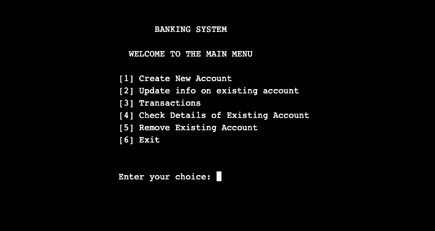
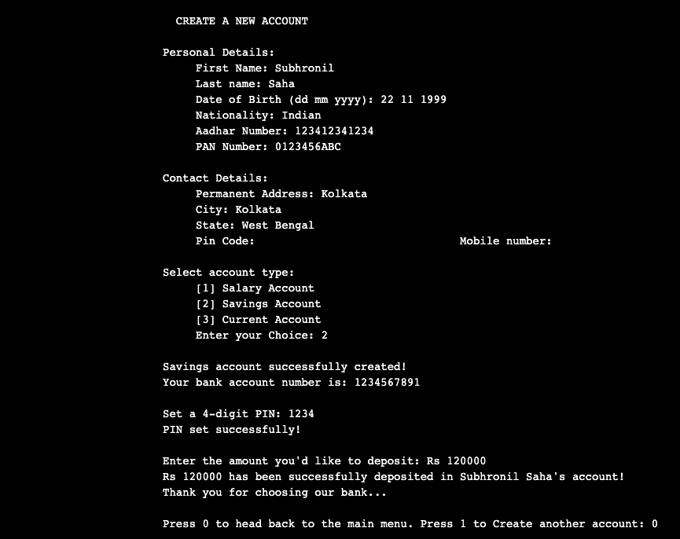
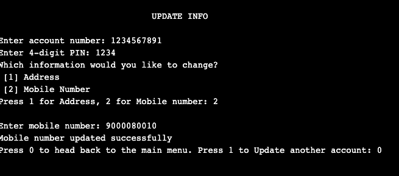
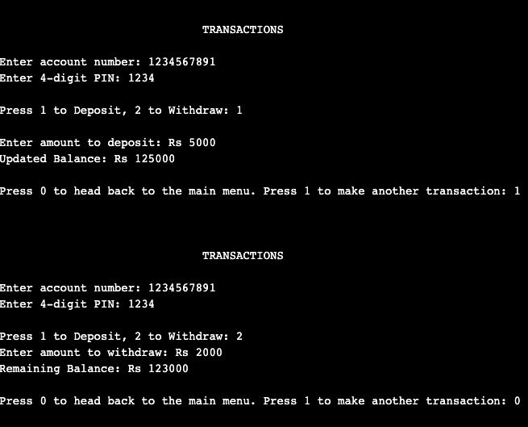
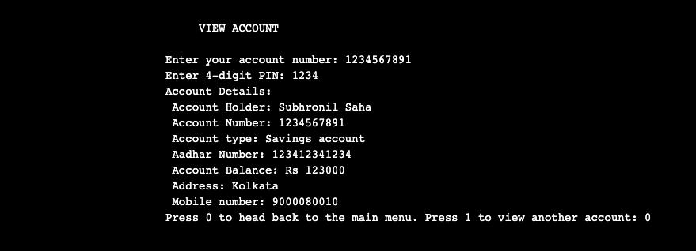
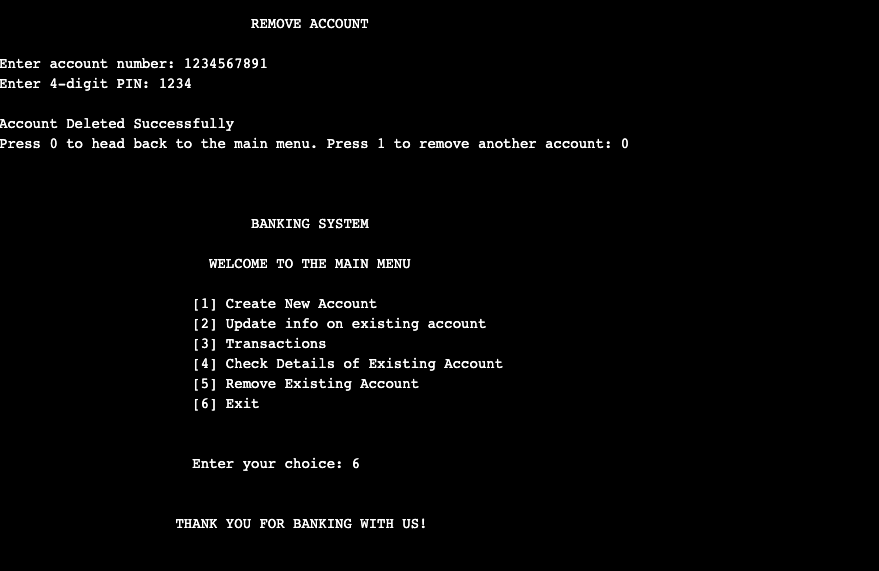

# Banking System in C

A very basic banking system developed in C, built during 1st semester of college as part of introductory C programming course.

## Screenshots:

### Intro Screen:

 

### Create a New Account Screen:

 

### Update Account Details Screen:

 

### Transaction Screen:

 

### View Details Screen:

 

### Remove & Exit Screen:

 
